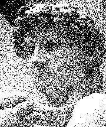
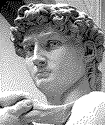
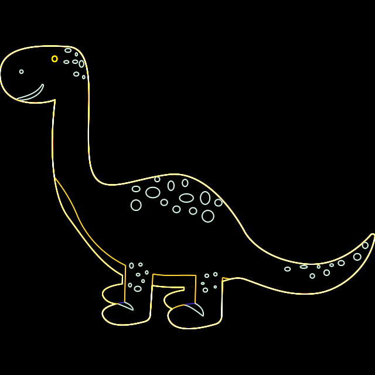
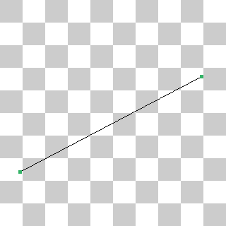
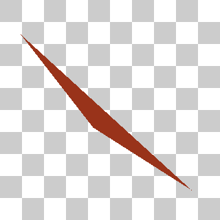
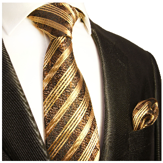
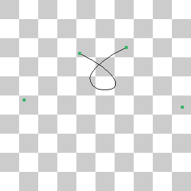

# 报告

## Task 1: Image Dithering

### Uniform Random

使用 `std::mt19937` 和 `std::uniform_real_distribution` 生成 $[-0.5, 0.5)$ 中的随机实数，给每个像素的三个通道加上同一个随机数，然后使用 Threshold 算法。

### Blue Noise Random

给原图加上蓝噪声，然后使用阈值为 $1$ 的 Threshold 算法。

### Ordered

使用类似课件上的分布顺序，设像素的值是 $x$，则画 $\lfloor 9x \rfloor$ 个点。

### Error Diffuse

过程与课件描述的大体相同。细节上，超出图像边界的权值直接忽略，而非分摊到未超出边界的其他像素。

## Task 2: Image Filtering

### Blur

对每个通道使用卷积核
$$
\frac{1}{9}
\begin{pmatrix}
    1 & 1 & 1 \\
    1 & 1 & 1 \\
    1 & 1 & 1
\end{pmatrix}
$$
和 $1$ 的 padding，输出大小维持不变。

### Edge

对每个通道使用卷积核
$$
\begin{pmatrix}
    1 & 2 & 1 \\
    0 & 0 & 0 \\
    -1 & -2 & -1
\end{pmatrix}
,
\begin{pmatrix}
    1 & 0 & -1 \\
    2 & 0 & -2 \\
    1 & 0 & -1
\end{pmatrix}
$$
和 $1$ 的 padding，得到两幅相同大小的图像，合并每个像素每个通道 $x = \sqrt{x_1^2+x_2^2}$，其中 $x_1,x_2$ 是两幅图像中该位置该通道的值，$x$ 是最终输出的值。

P.S. 这里最终的值可能可能超过 $1$，因为卷积核未乘 $1/4$ 的系数，导致输出特别亮，但 Tutorial 的参考结果和这种方法得到的结果恰好一样，这是否是一个疏忽？（我仍然提交了这种方法。）

## Task 3: Image Inpainting

把边界处设置为对应位置的背景图片减去贴图的权值。

## Task 4: Line Drawing

通过两次翻转操作限定线段斜率在 $[0,1]$ 内，然后使用 Bresenham 算法。

## Task 5: Triangle Drawing

选择 $x$ 坐标最小的顶点，另两个点按照极角序进行区分。枚举一个整数 $x$ 坐标，计算该直线位于三角形内的整点的区间并上色。

## Task 6: Image Supersampling

对输出图像的每个像素，计算原图中对应的位置，并选择周围 `rate` $\times$ `rate` 个位置的平均值作为其值。

`rate=1`

`rate=5`

## Task 7: Bezier Curve

设点数为 $n$，对每对相邻点做线性插值得到一列 $n-1$ 个点，递归此过程直到 $n=1$，返回该点。

